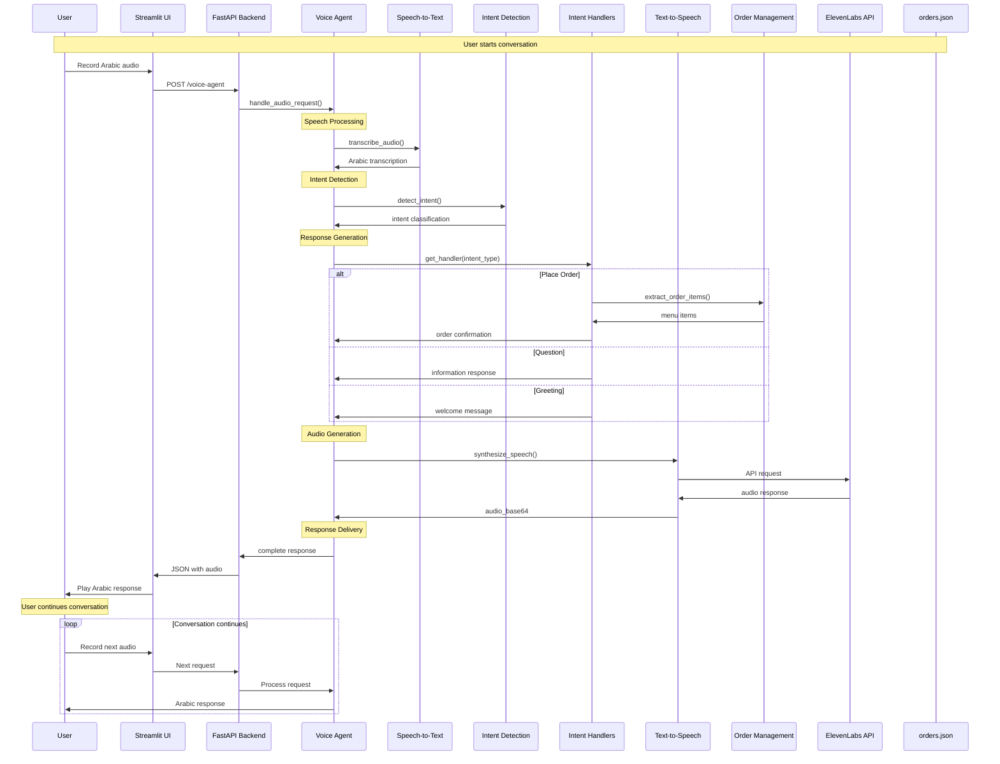

# Syrian Arabic AI Voice Agent for Charco Chicken 🍗

A sophisticated Arabic voice assistant designed specifically for Charco Chicken restaurant, enabling customers to place orders, ask questions, and interact naturally in Syrian Arabic through voice commands.

---

## 🏗️ High-Level System Architecture

[](https://drive.google.com/file/d/1To3OgRoNI6Tll53A2oXTz2YQOfW34kgv/view?usp=sharing)

> _Click the image above to view the full system architecture diagram on Google Drive._

---

## 🚦 API Documentation (Swagger)

- **Interactive Swagger UI** is enabled for this project.
- You can explore and test all API endpoints at:
  - [http://localhost:5050/docs](http://localhost:5050/docs) (Swagger UI)
  - [http://localhost:5050/redoc](http://localhost:5050/redoc) (ReDoc)

---

### Complete System Architecture Flow



---

### Technology Stack

- **Frontend**: Streamlit (Python web framework)
- **Backend**: FastAPI (Python web framework)
- **Speech-to-Text**: OpenAI Whisper (large model)
- **Text-to-Speech**: ElevenLabs API
- **Intent Detection**: Custom Arabic intent classification
- **Data Storage**: JSON files (orders.json)
- **Language**: Python 3.11+

## 🚀 Quick Start

### Prerequisites

- Python 3.11+
- Conda environment with PyTorch
- ElevenLabs API key
- FFmpeg (for audio processing)

### Installation

1. **Clone the repository**
   ```bash
   git clone https://github.com/MohmadSabri98/Syrian-Arabic-AI-Voice-Agent-for-Charco-Chicken.git
   cd Syrian-Arabic-AI-Voice-Agent-for-Charco-Chicken
   ```

2. **Create and activate conda environment**
   ```bash
   conda create -n torch_env python=3.11
   conda activate torch_env
   ```

3. **Install dependencies**
   ```bash
   pip install -r requirements.txt
   ```

4. **Set up environment variables**
   ```bash
   # Create .env file
   echo "# ElevenLabs API Configuration" > .env
   echo "ELEVENLABS_API_KEY=your_api_key_here" >> .env
   echo "VOICE_ID=your_voice_id_here" >> .env
   echo "API_URL=http://localhost:5050" >> .env
   echo "PORT=5050" >> .env
   ```

### Running the Application

1. **Start the FastAPI backend**
   ```bash
   conda run --live-stream --name torch_env python app.py
   ```

2. **Start the Streamlit frontend**
   ```bash
   conda run --live-stream --name torch_env streamlit run streamlit_app.py
   ```

3. **Access the application**
   - Frontend: http://localhost:8501
   - Backend API: http://localhost:5050

## 📋 API Documentation

### Voice Agent Endpoint

**POST** `/voice-agent`
- **Purpose**: Process audio input and return Arabic voice response
- **Input**: Audio file (WAV format)
- **Output**: JSON with transcription, intent, reply text, and audio

### Submit Order Endpoint

**POST** `/submit-order`
- **Purpose**: Submit customer order
- **Input**: JSON with name, order items, and dialog history
- **Output**: Order confirmation with Arabic order ID

**Example Request:**
```json
{
  "name": "أحمد",
  "order": ["دجاج مشوي", "بطاطا مقلية"],
  "dialog_history": []
}
```

### List Orders Endpoint

**GET** `/list-orders`
- **Purpose**: Retrieve all orders
- **Output**: JSON array of orders

## 🍽️ Menu Items

| Item (Arabic) | English | Price |
|---------------|---------|-------|
| دجاج مشوي | Grilled Chicken | 25,000 ليرة |
| بطاطا مقلية | French Fries | 8,000 ليرة |
| عصير | Juice | 5,000 ليرة |
| سلطة | Salad | 10,000 ليرة |
| شاورما | Shawarma | 15,000 ليرة |
| صحن أرز | Rice Plate | 7,000 ليرة |
| مشروب غازي | Soft Drink | 4,000 ليرة |
| دجاج مقلي | Fried Chicken | 27,000 ليرة |

## 🧪 Testing

### Running Unit Tests

The project includes comprehensive unit tests for all services and components. To run the test suite:

```bash
# Run all tests
conda run --live-stream --name torch_env pytest tests/ -v

# Run specific test file
conda run --live-stream --name torch_env pytest tests/test_voice_agent_service_impl.py -v

# Run tests with coverage
conda run --live-stream --name torch_env pytest tests/ --cov=services --cov-report=html

# Run tests in parallel
conda run --live-stream --name torch_env pytest tests/ -n auto
```

### Test Coverage

The test suite covers:
- ✅ **TTS Service** - ElevenLabs API integration and error handling
- ✅ **Whisper Service** - Speech-to-text functionality and audio processing
- ✅ **Intent Service** - Intent detection and classification
- ✅ **Voice Agent Service** - Main orchestrator and response generation
- ✅ **Order Service** - Order processing and management
- ✅ **Intent Handlers** - All intent handler implementations
- ✅ **Error Handling** - Exception scenarios and edge cases

### Test Framework

- **Framework**: pytest
- **Mocking**: unittest.mock
- **Async Testing**: pytest-asyncio
- **Coverage**: pytest-cov

## 🤖 AI Models & Frameworks

### Speech-to-Text (Whisper)
- **Model**: OpenAI Whisper Large
- **Language**: Arabic (ar)
- **Framework**: PyTorch
- **Features**: 
  - Real-time Arabic speech recognition
  - Handles Syrian Arabic dialect
  - Supports various audio formats
  - Automatic language detection

### Intent Detection
- **Framework**: Custom Arabic Intent Classification
- **Model**: Transformer-based sequence-to-sequence
- **Training Data**: Arabic restaurant conversations
- **Intents Supported**:
  - Place Order (تقديم طلب)
  - Question (سؤال)
  - Greeting (ترحيب)
  - Gratitude (شكر)
  - Complaint (شكوى)
  - Cancel Order (إلغاء الطلب)
  - Provide Name (تقديم الاسم)

### Text-to-Speech (ElevenLabs)
- **API**: ElevenLabs Text-to-Speech
- **Voice**: Arabic voice model
- **Features**:
  - Natural Arabic speech synthesis
  - Emotion and tone control
  - Multiple voice options
  - Real-time generation

### Training Data

The intent detection model was trained on:
- **Arabic Restaurant Conversations**: Real customer interactions
- **Syrian Arabic Dialect**: Local dialect variations
- **Menu Items**: All restaurant menu items in Arabic
- **Common Phrases**: Greetings, questions, and responses
- **Order Patterns**: Various ways to place orders in Arabic

### Data Sources
- **Customer Interactions**: Real restaurant conversations
- **Menu Items**: Charco Chicken menu in Arabic
- **Common Expressions**: Syrian Arabic phrases and idioms
- **Order Patterns**: Different ways customers place orders

## 📁 Project Structure

```
Syrian-Arabic-AI-Voice-Agent-for-Charco-Chicken/
├── app.py                          # FastAPI backend
├── streamlit_app.py                # Streamlit frontend
├── requirements.txt                # Python dependencies
├── .env                           # Environment variables
├── orders.json                    # Order database
├── constants/                     # Application constants
│   ├── app_constants.py          # General constants
│   └── order_constants.py        # Menu and pricing
├── enums/                        # Enum definitions
│   └── intent_enum.py           # Intent types
├── services/                     # Service implementations
│   └── impl/
│       ├── tts_service_impl.py   # Text-to-Speech
│       ├── whisper_service_impl.py # Speech-to-Text
│       ├── intent_service_impl.py # Intent detection
│       ├── voice_agent_service_impl.py # Main orchestrator
│       ├── order_service_impl.py # Order management
│       └── intent_handlers/      # Intent handlers
│           ├── factory.py        # Handler factory
│           ├── place_order.py    # Order placement
│           ├── question.py       # Q&A handling
│           └── ...               # Other handlers
└── tests/                        # Unit tests
    ├── test_tts_service_impl.py
    ├── test_whisper_service_impl.py
    ├── test_intent_service_impl.py
    ├── test_voice_agent_service_impl.py
    ├── test_order_service_impl.py
    └── test_intent_handlers.py
```

## �� Configuration

### How to Acquire an ElevenLabs API Key
1. Go to [https://elevenlabs.io/](https://elevenlabs.io/) and sign up for an account.
2. After logging in, navigate to your account dashboard.
3. Find the "API Keys" section and generate a new API key.
4. Copy the API key and add it to your `.env` file as:
   ```
   ELEVENLABS_API_KEY=your_api_key_here
   ```

### How to Pick a Voice ID from ElevenLabs
1. In your ElevenLabs dashboard, go to the "Voices" section.
2. Browse the available voices and click on a voice to view its details.
3. Copy the "Voice ID" shown for your chosen voice.
4. Add the Voice ID to your `.env` file as:
   ```
   VOICE_ID=your_voice_id_here
   ```

---

## 🤝 Contributing

1. Fork the repository
2. Create a feature branch
3. Make your changes
4. Add tests for new functionality
5. Submit a pull request

## 🙏 Acknowledgments

- **OpenAI Whisper** for Arabic speech recognition
- **ElevenLabs** for Arabic text-to-speech
- **FastAPI** for the robust backend framework
- **Streamlit** for the user-friendly interface

## 📞 Support

For support and questions, please open an issue on GitHub or contact the development team.

---

**Built with ❤️ for Charco Chicken customers in Syria** 